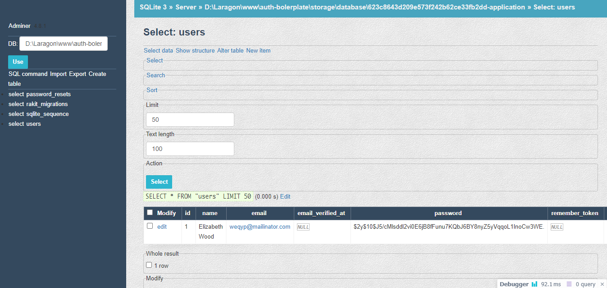

# adminer

<p align="center"></p>

Paket manajemen database berbasis [Adminer](https://adminer.org) untuk rakit framework.

## Instalasi
Jalankan perintah berikut via rakit console:

```sh
php rakit package:install adminer
```


## Mendaftarkan paket

Tambahkan kode berikut ke file `application/packages.php`:

```php
'adminer' => ['handles' => 'adminer'],
```

Lalu buka file konfigurasi milik paket ini dan tambahkan middleware
agar hanya admin saja yang bisa mengakses paket ini.

Caranya, buka file `packages/adminer/config/main.php` dan
tambahkan middleeware anda disana:

```php
'middlewares' => [
    'auth',
    'admin_only', // ubah ini sesuai nama middleware anda
],
```

Anda juga dapat mengubah konfigurasi lain di file tersebut jika diperlukan.

**PENTING !!**

Saya ulangi, pastikan bahwa anda telah menambahkan middleware sehingga
hanya admin saja yang dapat mengakses routing milik paket ini.

Secara default, paket ini sudah menerapkan middleware `'auth'` sehingga
hanya user yang sudah login saja yang bisa nengaksesnya.

Tetapi, memberikan akses ke selain admin sangat berbahaya
karena orang lain akan dapat membuka dan mengubah isi database anda!


## Cara penggunaan

Baik, setelah middleware selesai ditambahkan, anda sudah dapat mengaksesnya
melalui url `/adminer` seperti contoh berikut:

```
https://situsku.com/adminer
```

Jika semuanya baik - baik saja, anda akan langsung bisa mengakses database
mengikuti koneksi yang anda atur di konfigurasi database default aplikasi anda.


## Mengubah driver database

Secara default, adminer akan otomatis mencoba terkoneksi ke database default
yang anda atur di file konfigurasi `application/config/database.php`, yang secara
default di set ke `sqlite`.

Namun tentu saja dapat kapanpun mengubah koneksinya sesuai kebutuhan.

Misalnya, anda ingin mngubah koneksinya untuk menggunakan `mysql`, maka
cukup ubah file konfigurasi di file `database.php` anda seperti berikut:

```php
'default' => 'mysql',
```

Dan jangan lupa isikan juga kredensial koneksi mysql anda agar koneksi dapat dijalankan.


## Lisensi

Paket ini dirilis dibawah [Lisensi MIT](https://github.com/esyede/notyf/adminer/main/LICENSE)
